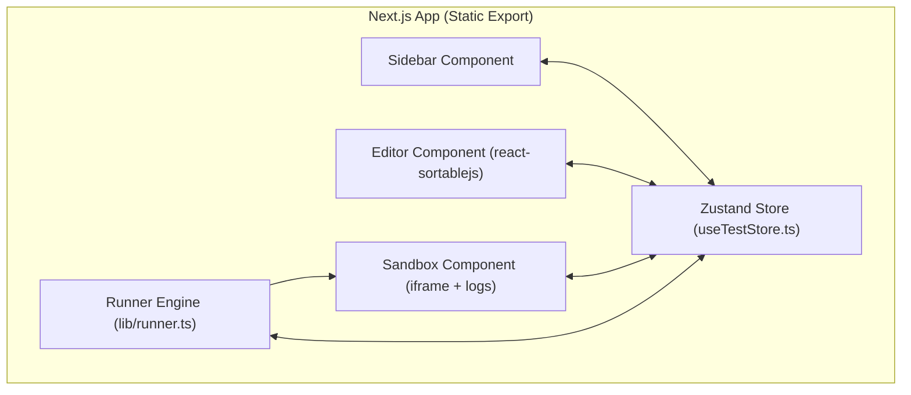

## 1. 架构设计


## 2. 技术说明
- 前端核心：Next.js (App Router), React, TypeScript
- 状态管理：Zustand + persist middleware
- 样式方案：Tailwind CSS
- 图标库：Lucide-React
- 拖拽库：react-sortablejs
- 截图工具：html2canvas
- 构建工具：Next.js (`output: 'export'`)
- 存储方案：`window.localStorage`（利用浏览器本地存储特性，实现多用户的天然数据隔离）。

## 3. 核心对象与数据结构定义

```typescript
type StepType = 'goto' | 'click' | 'input' | 'select' | 'wait_element' | 'assert_text' | 'assert_exist' | 'assert_not_exist' | 'delay' | 'scroll' | 'clear_input';

interface TestCaseStep {
    id: string;
    type: StepType;
    selector?: string;
    value?: string;
    timeout?: number;
}

interface TestCase {
    id: string;
    name: string;
    category: string;
    steps: TestCaseStep[];
}
```

## 4. 关键 API 与沙箱交互
- **元素查找**：封装支持 CSS 和 XPath 的查询工具。
- **事件模拟**：使用 `new MouseEvent('click')`, `new Event('input', { bubbles: true })` 等原生 API。
- **执行间隔**：`await new Promise(resolve => setTimeout(resolve, delay))`。

## 5. 项目部署
静态导出：
1. 运行 `npm run build`，Next.js 会在 `out/` 目录下生成纯静态 HTML/CSS/JS 文件。
2. 将 `out/` 内容直接上传到 GitHub Pages 或任何静态托管服务器。
