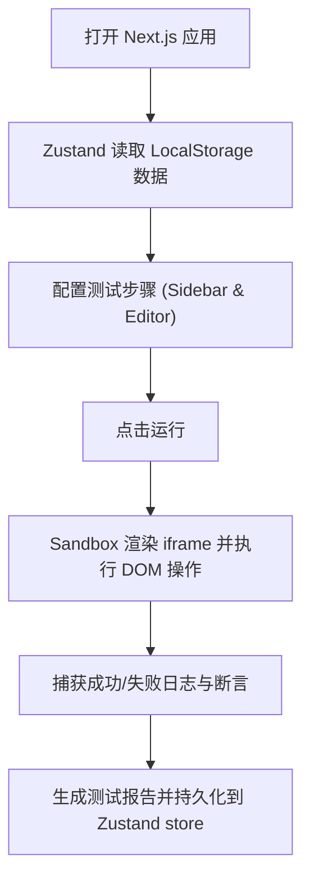

## 1. 产品概述
纯前端浏览器 UI 自动化测试框架 (Next.js 架构版)。
- 基于 Next.js 静态导出特性，完全在浏览器端运行。
- 提供用例管理、步骤拖拽编排、iframe 运行沙箱和可视化报告。
- 无后端依赖，数据完全本地化，天然支持多人访问隔离。

## 2. 核心功能模块

### 2.1 功能模块
1. **用例编辑器可视化面板**：React 组件化，利用 Zustand 进行状态流转。
2. **沙箱待测页面运行区**：集成 iframe 和日志打印组件。
3. **自动化执行控制面板**：速度调节，用例启停。
4. **断言 & 报错体系**：html2canvas 错误截图。
5. **测试报告模块**：测试数据统计与结果展示。
6. **数据导入导出**：用例的本地 JSON 导入导出、LocalStorage 清理。

## 3. 核心流程
用户进入页面 -> 创建测试用例 -> 添加 UI 自动化操作步骤（跳转、点击、输入等）-> 运行用例 -> 框架在右侧 iframe 中模拟用户行为 -> 收集执行日志与截图 -> 生成可视化测试报告。

## 4. 用户界面设计
### 4.1 设计风格
- 现代极简风格，基于 Tailwind CSS v4 / PostCSS。
- 组件库：Lucide-React 图标。

### 4.2 响应式设计
以桌面端为主（Desktop-first），适配大屏测试。因为自动化测试编辑器主要在 PC 端使用。提供 iframe 尺寸切换（模拟 PC/平板/手机）功能。
